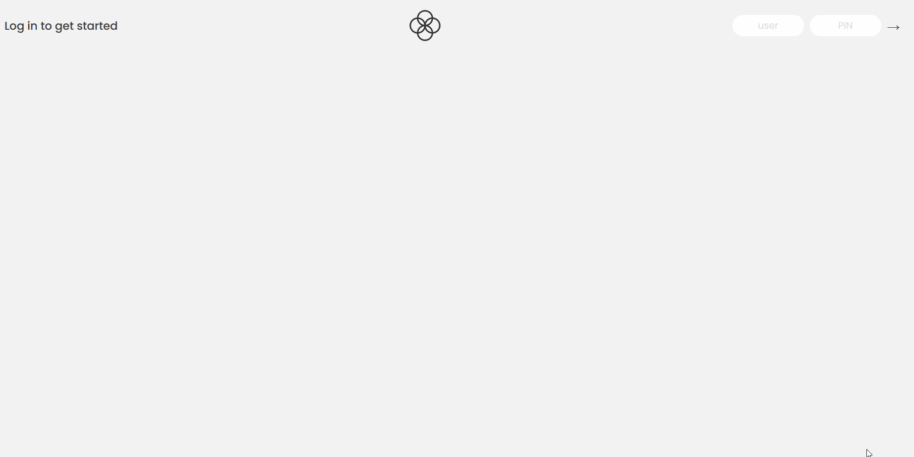

# Bankist-App

Hello there,

Find here a banking transaction management tool. :moneybag:

Log in to your **account**, see the **total amount** you have in your account and keep track **in real time** of your **deposits** and
**withdrawals**. 

Data are **hard-coded** in **JS**.

Example of different data that contain the **movement** of dates : :white_check_mark:


```const account1 = {
  owner: "Anthony Gyselman",
  movements: [200, 455.23, -306.5, 25000, -642.21, -133.9, 79.97, 1300],
  interestRate: 1.2, // %
  pin: 1111,

  movementsDates: [
    "2019-11-18T21:31:17.178Z",
    "2019-12-23T07:42:02.383Z",
    "2020-01-28T09:15:04.904Z",
    "2020-04-01T10:17:24.185Z",
    "2020-05-08T14:11:59.604Z",
    "2020-07-26T17:01:17.194Z",
    "2020-07-28T23:36:17.929Z",
    "2020-08-01T10:51:36.790Z",
  ],
  currency: "EUR",
  locale: "pt-PT", // de-DE
};```

A **timer** will **close** your **session** after a certain **time** that you define.

Example of the function that allows to do this : :white_check_mark:

// Function

```const startLogOutTimer = function () {
  const tick = function () {
    const min = String(Math.trunc(time / 60)).padStart(2, 0);
    const sec = String(time % 60).padStart(2, 0);

    // In each call, print the remaining time to UI
    labelTimer.textContent = `${min}:${sec}`;

    // When 0 seconds, stop timer and log out user
    if (time === 0) {
      clearInterval(timer);
      labelWelcome.textContent = "Log in to get started";
      containerApp.style.opacity = 0;
    }

    // Decrease 1s
    time--;
  };

  // Set time to 5 minutes
  let time = 120;

  // Call the timer every second
  tick();
  const timer = setInterval(tick, 1000);

  return timer;
};```
// End Function

You can **transfer** money from one account to another or request a **loan** from the bank :bank: (virtual).

The design of this page is realized with :

* HTML
* CSS
* JavaScript

This project highlights **dom manipulation** in JavaScript.

## Requirements

1. Good knowledge of JavaScript **functions** and **DOM manipulation**

## Below a gif allowing to realize the design and how the app works

